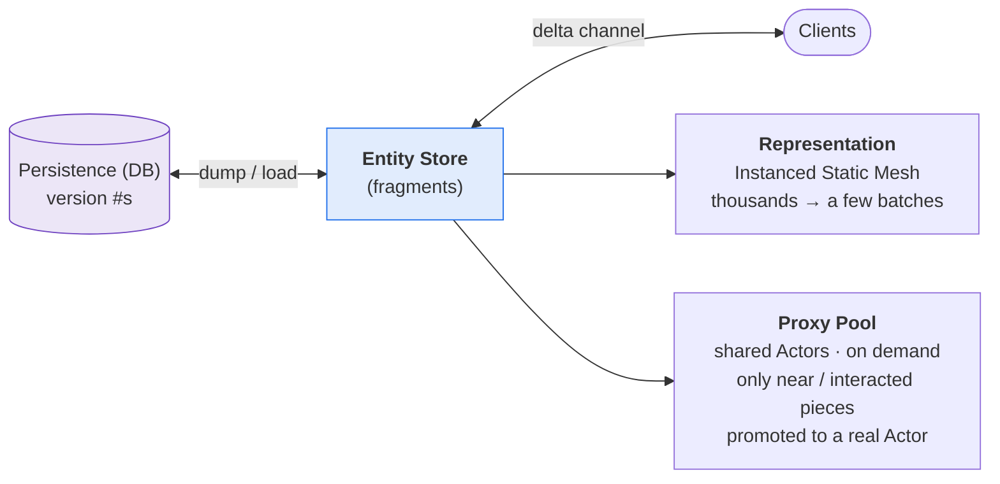

# Data-Oriented Building — An ECS-Style Building System

> 一套能承载**海量、永久**建筑的建造系统技术参照实现：用实体 + 片段（ECS / Mass 风格）取代"每个建筑一个 Actor"，配合实例化渲染、增量同步、以及按需的 Actor 对象池。
>
> A reference implementation of an open-world building system built to hold a **very large number of persistent objects**. Building pieces are **lightweight entities composed of fragments** (an ECS/Mass-style model) rather than one `Actor` each — rendered instanced, replicated through a throttled delta channel, and promoted to a real `Actor` only on demand from a shared pool.

<p align="left">
  
  
  
  
</p>

---

## 📌 Context

This distills a system I designed and owned in a shipped commercial title, where players build
homes freely and buildings persist **permanently** — a single base can hold **thousands** of
pieces. I was responsible for the whole framework: persistence, synchronization, entity/proxy
management, and the modular workflow other engineers and designers extended.

> **This repository is a clean-room reference.** Original code written for portfolio purposes,
> reduced to the load-bearing architecture. It contains **no proprietary or third-party source**;
> engine-facing types are illustrative stand-ins.

---

## 🎯 The problem, precisely

One `AActor` per building piece blows up on three axes at once:

| Axis | Failure at scale |
|---|---|
| **CPU / memory** | Thousands of actors, components, and tick registrations. |
| **Network** | Thousands of replicated actors saturating the channel. |
| **Rendering** | Thousands of draw calls. |

And a fourth, softer constraint that shaped the architecture as much as performance: the core
building **rules were redesigned several times** during development, so the system had to be
**reshapeable without rewrites**.

---

## 🧭 Architecture — entities, not actors



**The central idea:** *the number of live Actors is decoupled from the number of buildings.*
Most pieces are pure data plus an instanced mesh; only the handful a player is near become
actors. Everything else in the design follows from that decision.

- **Entity = a set of fragments** — a piece is data (transform, health, type, support, coating…),
  no actor or components until it needs one.
- **Representation** draws pieces as **Instanced Static Meshes** — thousands of identical walls
  collapse into a few draw batches.
- **Proxy pool** lends a capped number of shared `Actor` proxies for collision/interaction/UI.
- **Persistence** dumps/loads entities with **version numbers** for incremental saving.

---

## 🎮 Gameplay: pieces, components, and the build flow

The data-oriented core above is the *storage / performance* layer. The gameplay a player actually
touches lives in the actor-side **build pieces** and the **build flow** that places them.

### Build pieces = a base actor + pluggable components

A building object isn't a monolithic class — it's an `ABuildPiece` composed of only the
components it needs. A wall needs snapping + support; a door adds interaction; a furnace adds
production. Concrete objects subclass the base and initialize their own distinctive data.

| Component | Responsibility |
|---|---|
| `BuildSnapComponent` | Snap points — what this piece can snap *to*, and what can snap to *it* |
| `CombinableSlotComponent` | Slots that accept / reject specific pieces (a wall slot only takes a door or window) |
| `BuildInteractComponent` | Proximity region that surfaces context actions (open door, deposit, light furnace) |

```cpp
// A concrete object is a small subclass that just wires its own data + interaction.
class ADoorPiece : public ABuildPiece
{
    virtual void InitDistinctiveData() override { /* door-specific state */ }
    virtual void OnInteract(APlayerCharacter* Player, int32 InteractionId) override
    {
        ToggleOpen();   // open / close — the door's whole gameplay is one override
    }
};
```

See [`src/BuildPiece.h`](src/BuildPiece.h).

### The build flow: hold → snap → validate → place

While the player "holds" a piece in preview, each frame the flow raycasts from the camera,
gathers **snap candidates** (an *active* snap point on the held piece meeting a *passive* snap
point on a nearby piece), ranks them by priority, snaps to the best, and validates placement
(overlap / support / build-count limit / area) before allowing a commit — the preview turns
green or red on that result.

```cpp
// Rank snap candidates and take the best; lower Priority value wins.
bool UBuildHoldFlow::ResolveBestSnap(const TArray<FSnapCandidate>& Candidates, FTransform& OutPose) const
{
    const FSnapCandidate* Best = nullptr;
    for (const FSnapCandidate& C : Candidates)
        if (!Best || C.Priority < Best->Priority) Best = &C;

    if (!Best) return false;
    OutPose = ComputeSnappedPose(*Best);   // align the active point onto the passive point
    return true;
}

// Placement is only legal if it passes every rule.
EPlaceRejectReason UBuildHoldFlow::ValidatePlacement(const FTransform& Pose) const
{
    if (IsOverlapping(Pose))     return EPlaceRejectReason::Overlapping;
    if (!HasEnoughSupport(Pose)) return EPlaceRejectReason::NoSupport;     // no floating pieces
    if (ReachedBuildLimit())     return EPlaceRejectReason::ReachBuildLimit;
    if (!InBuildableArea(Pose))  return EPlaceRejectReason::OutOfArea;
    return EPlaceRejectReason::None;
}
```

See [`src/BuildHoldFlow.h`](src/BuildHoldFlow.h). The same flow also drives **selecting, moving,
and demolishing** existing pieces.

---

## 1. Fragment composition + replicated / transient split

**Decision.** Keep the replicated agent as small as possible; push everything that doesn't need
to sync into a **transient side-struct held by pointer**, off the hot array.

**Why.** The replicated array is walked every frame for representation and replication. Cold data
(asset handles, the bound proxy, selection state) has no business on that hot path — it inflates
per-object memory and hurts cache locality on the traversal that runs at scale. Separating the two
keeps the hot array tight and fast, and keeps agent copies inside the fast-array cheap.

```cpp
// BuildingAgent.h — replicated agent holds ONLY what must cross the wire; cold state lives
// behind a TSharedPtr, off the hot array, so copying agents never drags it along.
USTRUCT()
struct FBuildingAgent
{
    GENERATED_BODY()

    UPROPERTY() FTransformFragment Transform;   //  \
    UPROPERTY() FHealthFragment    Health;      //   } replicated fragments — compact & cache-friendly
    UPROPERTY() FTypeFragment      Type;        //   /
    UPROPERTY() FSupportFragment   Support;     //  /

    TSharedPtr<FBuildingTransient> Transient;   // NOT replicated: asset handle, bound proxy, selection...
};
```

See [`src/BuildingAgent.h`](src/BuildingAgent.h).

---

## 2. Delta replication with throttling + weak-net adaptation

**Decision.** Replicate through a fast-array delta channel with a **per-frame change/delete
budget** that *shrinks under packet loss*.

**Why.** Even as data, thousands of pieces cannot all sync in one tick — and a naive burst makes
congestion worse exactly when the network is already struggling. A per-frame budget spreads the
cost; making that budget **network-adaptive** turns a hard failure (channel collapse under loss)
into graceful degradation (slower, but stable).

```cpp
// BuildingClientBubble.h — good network pushes a healthy batch; detected loss throttles hard.
int32 UBuildingClientBubble::GetChangesBudgetThisFrame() const
{
    return bBadNetwork ? Val_MaxChangesPerUpdate_BadNet   // e.g. 5
                       : Val_MaxChangesPerUpdate;         // e.g. 50
}

void UBuildingClientBubble::ServerTick()
{
    int32 Budget = GetChangesBudgetThisFrame();
    for (uint32 Entity : DirtyEntities)          // dirty set, priority-ordered (distance/visibility)
    {
        if (Budget-- <= 0) break;                // remainder waits for next tick
        MarkAgentDirtyForReplication(Entity);
    }
}
```

See [`src/BuildingClientBubble.h`](src/BuildingClientBubble.h).

---

## 3. On-demand actors from a shared proxy pool

**Decision.** Lend **shared** proxy actors from a capped pool, bound to an entity only while the
player is near, and reclaimed on exit.

**Why.** Interaction, collision, and UI genuinely need an `Actor` — but only for the pieces a
player can actually touch, which is a tiny, bounded set at any moment. A pool with a hard
`Val_MaxProxies` cap guarantees the live-actor count stays fixed *regardless* of how many thousands
of buildings exist. That cap is the guarantee that makes the whole "entities, not actors" claim
hold under adversarial player behaviour (e.g. someone building 10,000 walls).

```cpp
// ProxyPool.h — a LockCount lets several systems (collision/interaction/UI) share one proxy;
// the actor returns to the pool (not destroyed) when the last lock releases.
FProxyHandle UProxyPool::Acquire(FEntityHandle Entity, FName Reason);   // near range -> bind
void         UProxyPool::Release(FProxyHandle Handle, FName Reason);    // out of range -> reclaim
```

See [`src/ProxyPool.h`](src/ProxyPool.h).

---

## 4. Modularity as a workflow (why the team could scale on it)

Building *behaviours* are composable at three levels, so a new object is **assembled, not coded**:

| Level | Unit | Example |
|---|---|---|
| Data | **Fragment** | support value, coating, produce state |
| Behaviour | **Component** | snapping, interaction, level-up, production |
| Object | **Entity type** | a door / furnace / incubator = a specific combination |

This is the open/closed principle expressed as a *pipeline*: adding a new building object touches
no framework code. That is what let other engineers add features — and designers author a large
variety of objects — efficiently and in parallel, throughout the project.

---

## 🗂️ Repository layout

```
data-oriented-building/
├── README.md
└── src/
    ├── BuildPiece.h             Gameplay: base piece + pluggable functional components
    ├── BuildHoldFlow.h          Gameplay: hold → snap → validate → place build flow
    ├── BuildingAgent.h          Core: fragment composition + replicated/transient split
    ├── BuildingClientBubble.h   Core: delta replication — per-frame budget + weak-net throttle
    └── ProxyPool.h              Core: on-demand shared-Actor pool with a hard cap
```

A **reduced reference**: the load-bearing data model, replication throttle, and pooling, with the
engine's fast-array/ISM/subsystem plumbing abstracted so the design reads clearly.

---

## 💡 What this demonstrates

Data-oriented / ECS thinking applied to a concrete scaling problem; fluency across replication,
instanced rendering, memory layout, and pooling; and — the part I care about most — an
architecture designed for **constant change** and for **other people to extend**, not just to
perform.

## 📜 Notes

Original reference code authored by me for portfolio purposes. No proprietary or third-party source
is included; engine-facing types (fragments, client bubble, proxy actors) are illustrative
stand-ins for the real integration points.
